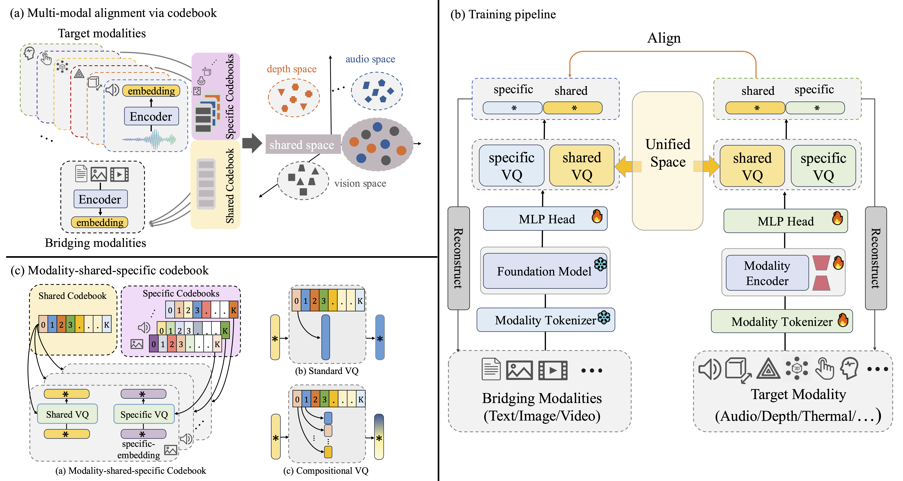

# CodeBind: Decoupled Representation Learning for Multimodal Alignment with Unified Compositional Codebook

<div align="center">
    <p>
        <a href="https://github.com/zykev">Zeyu Chen</a>&nbsp;&nbsp;
        <a href="https://scholar.google.com/citations?user=KfXHhQYAAAAJ&hl=zh-CN">Jie Li</a>&nbsp;&nbsp;
        <a href="https://www.kaihan.org/">Kai Han</a>
    </p>
    <p>
        Visual AI Lab, The University of Hong Kong
    </p>
</div>

<p align="center">
    <a href="https://arxiv.org/abs/XXXX.XXXXX" target="_blank">
    
    </a>
    <a href="https://visual-ai.github.io/codebind/" target="_blank">
    
    </a>
    <a href="https://huggingface.co/zykev/CodeBind" target="_blank">
    
    </a>
</p>

<div align="center">
    <a href="https://visual-ai.github.io/codebind/">
        
    </a>
    <p style="width: 90%; text-align: justify;">
        <sup>
        <i>Target modalities are partially aligned with bridging modalities via codebooks, resulting in a shared space. Unique features from both bridging and target modalities are preserved in specific space. Compositional VQ utilizes a combination of multiple low-dimensional codevectors to reconstruct a complete embedding.</i>
        </sup>
    </p>
</div>

## 📣 Updates
- **[April 16, 2026]** Initial Release

## ✨ Overview
Multimodal representation alignment is crucial for large language models and robotics. Traditional methods often struggle with cross-modal information discrepancies and data scarcity, resulting in suboptimal alignment spaces that neglect modality-unique features.

We introduce **CodeBind**, a novel framework that optimizes multimodal representation spaces using a **modality-shared-specific codebook** design.

Unlike conventional hard alignment approaches, CodeBind decomposes features into:
- **Shared Components**: Ensuring semantic consistency across modalities.
- **Specific Components**: Preserving modality-unique details.

This approach employs a compositional vector quantization scheme, where a shared codebook bridges modality gaps, and modality-specific codebooks mitigate representation bias by preventing dominant modalities from overshadowing others. Validated across **nine modalities** (text, image, video, audio, depth, thermal, tactile, 3D point cloud, EEG), CodeBind achieves state-of-the-art performance in multimodal classification and retrieval tasks.

## 📝 TODOs

- [x] Release the training code
- [ ] Release CodeBind-IB checkpoints
- [ ] Release applications code

## 🔨 Installation

First, clone the repository and install the required packages.

```bash
git clone https://github.com/Visual-AI/codebind.git
cd codebind
conda install pytorch==2.1.1 torchvision==0.16.1 torchaudio==2.1.1 pytorch-cuda=11.8 -c pytorch -c nvidia
pip install -r requirements.txt
```

## 📚 Quick Start

You can use CodeBind to extract and compare features across modalities. An example snippet is provided below:

```python
# TBD
```

## 📦 Datasets
Please refer to [Doc/DATASETS.md](Doc/DATASETS.md) for dataset preparation.

## 🧩 Model Zoo
Please refer to [Doc/MODEL_ZOO.md](Doc/MODEL_ZOO.md) for details on available CodeBind checkpoints.

<!-- **Note on Model Weights:** Due to the nature of the training datasets, the model weights are restricted to non-commercial research and educational purposes only. Redistribution of the weights must maintain this restriction. -->

## 🚀 Training & Inference
Please refer to [Doc/TRAINING.md](Doc/TRAINING.md) for details on CodeBind training scripts for different modalities.

## 🙏 Acknowledgements

This repository builds upon the invaluable contributions of the open-source community. We extend our sincere appreciation to the following projects for their foundational work:

- [ImageBind](https://github.com/facebookresearch/imagebind)
- [ViT-Lens](https://github.com/TencentARC/ViT-Lens)
- [ImageBind LoRA Implementation](https://github.com/fabawi/ImageBind-LoRA)


## 📜 Citation

If you find this repository useful, please consider giving a star ⭐ and citation:

```bibtex
@article{chen2026codebind,
    title={CodeBind: Decoupled Representation Learning for Multimodal Alignment
    with Unified Compositional Codebook},
    author={Zeyu Chen and Jie Li and Kai, Han},
    journal={arXiv preprint arXiv:},
    year={2026}
}
```

